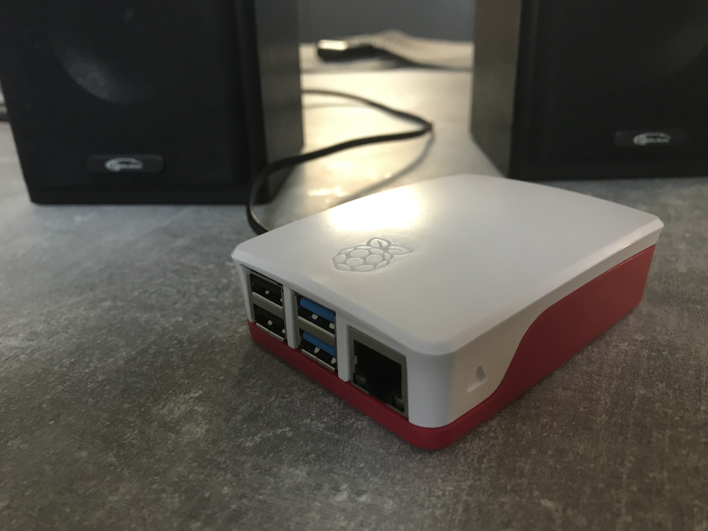

# MusicVotingServer
Bachelor Project

Structure:
- mvs-spring - contains backend. Written in Java with Spring Boot framework, using Maven for building.
- MVS-WebApp - contains frontend. Written in JavaScript ES6 with React framework, using Webpack for bundling. In addition this directory contains a directory with mp3 song files.
- mvs_flutter - mobile native client made with Flutter. Supports both Android and iOs.

</a>

Music Voting Server - is an application that generates playlists according to collected votes from users and plays music. It runs in a local wi-fi network and can be installed on Raspberry Pi (or any other computer).

Server side is written in Java using Spring Boot framework. On the client side there are React web app and mobile flutter client app available.

</a>

